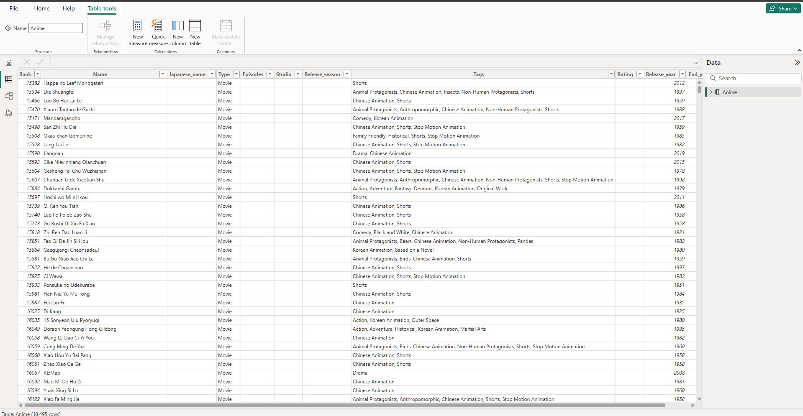

# VISUALISASI DATA ANIME

## 📌 Overview
Anime Data Dashboard adalah proyek visualisasi data menggunakan **Microsoft Power BI** untuk menganalisis tren anime berdasarkan berbagai parameter seperti rating, jenis anime, studio produksi, dan jumlah rilis anime dari waktu ke waktu.
untuk datanya kalian bisa cari kaggle atau bebas tergantung kalian mau dimana

## 📸 Foto

## 📊 Fitur Dashboard
1. **Distribusi Jenis Anime** 📊
   - Menampilkan persentase berbagai jenis anime seperti TV, Movie, OVA, Web, dan lainnya dalam bentuk pie chart.

2. **Rata-rata Rating Anime** ⭐
   - Menunjukkan rata-rata rating anime dalam skala 0-5 menggunakan gauge chart.

3. **Produksi Anime oleh Studio** 🏭
   - Visualisasi jumlah anime yang diproduksi oleh berbagai studio menggunakan bar chart.

4. **5 Anime Teratas Berdasarkan Rating** 🏆
   - Menampilkan lima anime dengan rating tertinggi menggunakan horizontal bar chart.

5. **Rilis Anime dari Tahun ke Tahun** 📅
   - Grafik line chart yang menunjukkan jumlah anime yang dirilis sejak tahun 1900 hingga sekarang.

## 🛠️ Teknologi yang Digunakan
- **Microsoft Power BI** - Untuk visualisasi data
- **Dataset Anime** - Data anime yang mencakup informasi genre, studio, rating, dan tahun rilis

## 🚀 Cara Menggunakan Dashboard
1. **Buka file Power BI (.pbix) dalam Microsoft Power BI**
2. **Pastikan dataset telah dimuat dengan benar**
3. **Gunakan filter di sisi kiri dashboard untuk menyaring data sesuai kebutuhan**
4. **Eksplorasi tren anime berdasarkan berbagai metrik yang tersedia**

## 📄 Lisensi
Proyek ini menggunakan **MIT License**. Lihat file `LICENSE` untuk detail lebih lanjut.

